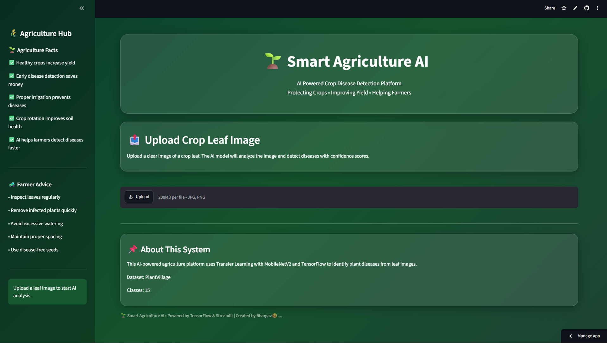
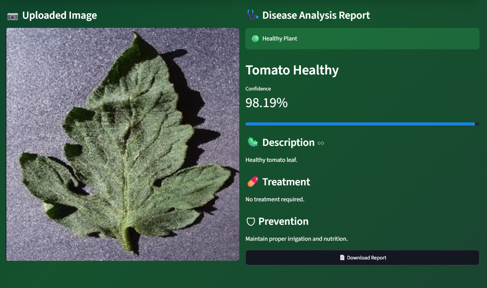
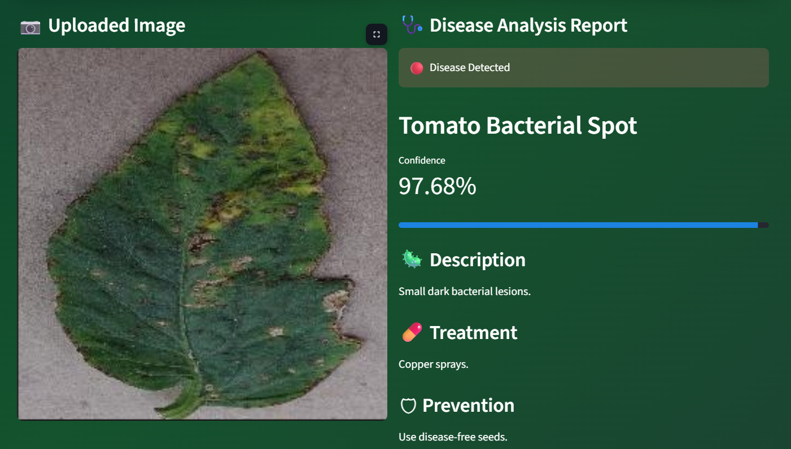

# AI_Powered_Plant_Disease_Detection
AI-powered plant disease detection system using TensorFlow, MobileNetV2, and Streamlit.
<div align="center">

# 🌱 AI Powered Plant Disease Detection

### Intelligent Crop Disease Diagnosis using Deep Learning

Built with **TensorFlow • MobileNetV2 • Streamlit**

[]()
[]()
[]()
[]()
[]()

### 🚀 Live Demo

**🌐 https://aipoweredplantdiseasedetection-co7qfqfxikbfrixrmb5rxa.streamlit.app/**

</div>

---

# 📖 Overview

AI Powered Plant Disease Detection is a Deep Learning web application that identifies diseases in plant leaves using image classification.

The application leverages **Transfer Learning with MobileNetV2** to classify plant diseases with high accuracy and provides useful recommendations including:

- Disease Name
- Confidence Score
- Disease Description
- Treatment
- Prevention
- Downloadable PDF Report

The project is designed to support **smart agriculture** by helping farmers and agriculture enthusiasts detect crop diseases quickly.

---

# ✨ Features

✅ Premium Streamlit UI

✅ MobileNetV2 Transfer Learning

✅ Plant Disease Prediction

✅ Confidence Score

✅ Disease Description

✅ Treatment Recommendation

✅ Prevention Tips

✅ Top-3 Predictions

✅ Download PDF Report

✅ Agriculture Information Sidebar

✅ Responsive Design

---

# 📸 Application Screenshots

## 🏠 Home Page



---

## 🌿 Healthy Prediction



---

## 🍂 Disease Prediction



---

# 🧠 Deep Learning Model

| Property | Value |
|----------|-------|
| Architecture | MobileNetV2 |
| Learning Method | Transfer Learning |
| Framework | TensorFlow |
| Classes | 15 |
| Dataset | PlantVillage |
| Images | 20,638 |
| Validation Accuracy | 87.13% |

---

# 🌱 Supported Plant Diseases

### Tomato

- Healthy
- Bacterial Spot
- Early Blight
- Late Blight
- Leaf Mold
- Septoria Leaf Spot
- Spider Mites
- Target Spot
- Yellow Leaf Curl Virus
- Mosaic Virus

### Potato

- Healthy
- Early Blight
- Late Blight

### Bell Pepper

- Healthy
- Bacterial Spot

---

# 🛠 Tech Stack

- Python
- TensorFlow
- Keras
- MobileNetV2
- Streamlit
- NumPy
- Pillow
- ReportLab

---

# 📂 Project Structure

```text
AI_Powered_Plant_Disease_Detection/
│
├── app.py
├── train.py
├── predict.py
├── dataset_loader.py
├── visualize_dataset.py
├── plant_disease_model.keras
├── requirements.txt
├── .gitignore
├── README.md
└── screenshots/
```

---

# ⚙ Installation

Clone the repository

```bash
git clone https://github.com/bhargavasaiii17-svg/AI_Powered_Plant_Disease_Detection.git
```

Move into the project

```bash
cd AI_Powered_Plant_Disease_Detection
```

Install dependencies

```bash
pip install -r requirements.txt
```

Run the application

```bash
streamlit run app.py
```

---

# 🚀 How It Works

1. Upload a plant leaf image.
2. Image is preprocessed.
3. MobileNetV2 predicts the disease.
4. Confidence score is displayed.
5. Treatment and prevention tips are shown.
6. Generate and download a PDF report.

---

# 📊 Model Performance

| Metric | Value |
|---------|-------|
| Validation Accuracy | **87.13%** |
| Dataset Images | **20,638** |
| Classes | **15** |
| Framework | TensorFlow |

---

# 🔮 Future Improvements

- Multi-language Support
- Real-time Camera Detection
- Fertilizer Recommendation
- Weather Integration
- Crop Recommendation System
- Cloud Database Support
- Farmer Dashboard
- Disease Severity Estimation

---

# 👨‍💻 Author

## Bhargav Sai

AI & Machine Learning Enthusiast

GitHub

https://github.com/bhargavasaiii17-svg

---

<div align="center">

### 🌾 Empowering Agriculture with Artificial Intelligence

⭐ If you found this project useful, consider giving it a star!

</div>
